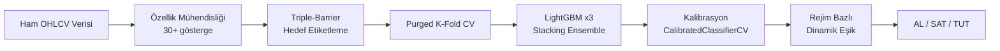
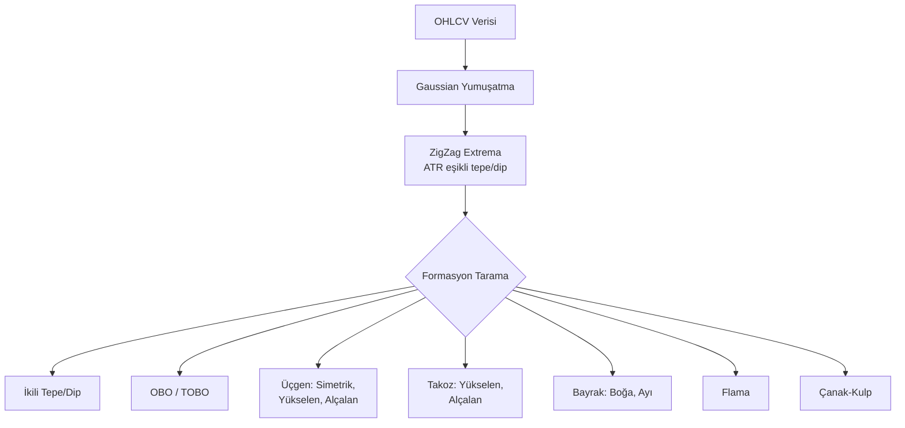
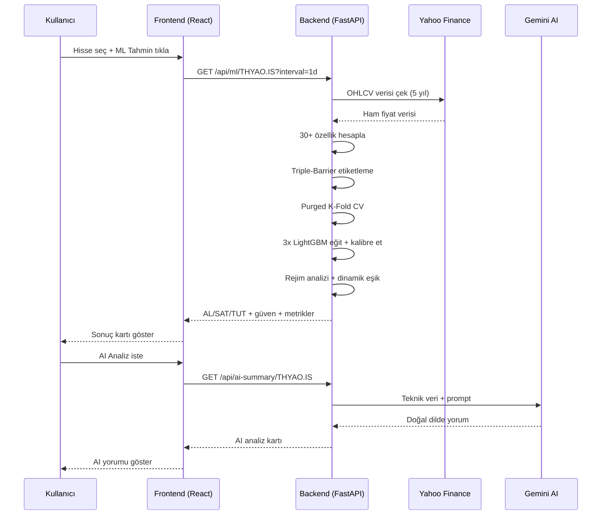

# 📊 BIST Borsa Analiz — Uygulama Sunumu

> **Proje:** BIST hisse analiz web uygulaması  
> **Stack:** FastAPI + React 19 + LightGBM  
> **Tarih:** 30 Nisan 2026

---

## 1. 📈 Grafik Sayfası


**Ne yapar?**
- **Lightweight Charts** ile interaktif mum grafiği
- MA20, MA50, Bollinger Bantları overlay olarak gösterilir
- **13 teknik formasyon** otomatik tespit edilir (OBO, İkili Tepe, Çanak-Kulp, Bayrak, Üçgen vb.)
- Formasyonlar grafiğin üstüne güven skoru ile etiketlenir
- Trend çizgisi, yatay çizgi ve Fibonacci çizim araçları
- Üst kartlar: Fiyat, RSI, MACD, Sinyal, Sentiment ve Rejim özeti

---

## 2. 🔍 Analiz (İndikatörler) Sayfası


**Ne yapar?**
- **Teknik İndikatörler Kartları:** RSI, MACD, Stochastic, BB Üst/Alt, MA20, MA50, MA200
- **Sinyal Paneli:** 5 bileşenli puanlama sistemiyle AL/SAT/TUT kararı
  - EMA50 trend, EMA20 trend, RSI momentum, MACD kesişim, BB pozisyonu
  - ATR bazlı Stop Loss ve Take Profit seviyeleri
- **AI Analiz Özeti:** Gemini AI ile teknik durumun doğal dilde yorumu
- **ML Tahmin butonu:** Tıklanınca LightGBM modeli eğitilip sonuç gösterilir

---

## 3. 📰 Haberler Sayfası


**Ne yapar?**
- Investing.com RSS feed'lerinden güncel Türkçe piyasa haberleri
- Her haber tarih ve kaynak bilgisiyle listelenir
- Haberler aynı zamanda **VADER sentiment analizi** ile skorlanır
- Sentiment skoru ML modeline girdi olarak beslenir

---

## 4. 👤 Analist Sayfası


**Ne yapar?**
- Yahoo Finance'den analist tavsiyeleri çekilir
- **Konsensüs tavsiye:** GÜÇLÜ AL / AL / TUT / SAT sınıflandırması
- Hedef fiyat ve analist sayısı gösterilir
- Mevcut fiyatla karşılaştırıldığında potansiyel yükseliş/düşüş yüzdesi

---

## 5. ⭐ Favoriler Sayfası


**Ne yapar?**
- Kullanıcının takip ettiği hisseleri `favorites.json` dosyasında saklar
- Tek tıkla hisse grafiğine geçiş
- Header'daki ⭐ butonu ile ekleme/çıkarma

---

## 6. 📊 BIST Sayfası


**Ne yapar?**
- 417+ BIST hissesi listelenir (BIST_UNIVERSE)
- Her hisse: fiyat, günlük değişim %, işlem hacmi
- Arama kutusuyla hızlı filtreleme
- Tıkla → o hissenin analiz sayfasına geç

---

## 7. 🗺️ Isı Haritası (Heatmap)


**Ne yapar?**
- **Sektörel gruplandırma:** Sanayi, Bankacılık, Enerji, Finans vb. 28 sektör
- Renk kodlaması: 🟢 yeşil = yükseliş, 🔴 kırmızı = düşüş
- Özet kartlar: Yükselen/Düşen sayısı, ortalama değişim, en iyi ve en kötü hisseler
- Sektör filtreleme ve sıralama (değişim, isim, fiyat, hacim)

---

## 🤖 ML Tahmin Sistemi — Nasıl Çalışır?

### Genel Mimari



---

### Adım 1: Özellik Mühendisliği (30+ Özellik)

Model, her hisse için aşağıdaki özellik kategorilerini hesaplar:

| Kategori | Özellikler | Açıklama |
|----------|-----------|----------|
| **Momentum** | RSI-14, Stochastic K, ROC-10, MFI | Fiyatın aşırı alım/satım durumu |
| **Trend** | MACD histogram, ADX-14, DI farkı, EMA20/50 oranı | Trendin yönü ve gücü |
| **Volatilite** | ATR-14, BB genişliği, BB pozisyonu, Vol regime z-skoru | Piyasanın hareketliliği |
| **Hacim** | Volume ratio-20, OBV eğimi, VWAP mesafesi | Alım-satım baskısı |
| **İstatistik** | Hurst proxy, log getiri, ret_skew_20, CCI-14 | Dağılım ve trend kalıcılığı |
| **Makro** | BIST100 5g getiri | Genel piyasa yönü |
| **Zaman** | Haftanın günü, ay, çeyrek | Mevsimsellik etkisi |
| **Gecikme** | RSI lag-1/2, MACD lag-1/2, Log_ret lag-1/2 | Modele "hafıza" kazandırma |

---

### Adım 2: Triple-Barrier Hedef Etiketleme

> Klasik "%2 yükseldi mi?" yerine **ATR tabanlı bariyer sistemi** kullanılır.

```
Üst Bariyer  = Kapanış + ATR × 1.8  (kâr hedefi)
Alt Bariyer  = Kapanış - ATR × 1.0  (zarar limiti)
Zaman Bariyeri = 5 işlem günü
```

- Fiyat önce **üst bariyere** temas ederse → **1 (AL)**
- Fiyat önce **alt bariyere** temas ederse veya süre dolarsa → **0 (SAT/TUT)**

> [!TIP]
> ATR bazlı etiketleme, her hissenin kendi volatilitesine uyum sağlar. Düşük volatiliteli bir hissede %2 çok iddialı olabilirken, yüksek volatiliteli birinde hiç zorlayıcı değildir.

---

### Adım 3: Purged K-Fold Cross Validation

> Zaman serisi verilerinde standart K-Fold **data leakage** (veri sızıntısı) oluşturur. Bunun önüne geçmek için **Walk-Forward Purged K-Fold** kullanılır.

```
Fold 0: Train=[0:100]  ← 5 bar purge →  Test=[105:120]
Fold 1: Train=[0:120]  ← 5 bar purge →  Test=[125:140]
Fold 2: Train=[0:140]  ← 5 bar purge →  Test=[145:160]
...
```

- **Purge:** Test sınırından 5 bar öncesinde eğitim kesilir (lag sızıntısı engellenir)
- **Embargo:** Test sonrasındaki barlar eğitime dahil edilmez
- **Combinatorial CPCV:** Farklı test bölge kombinasyonlarıyla daha robust metrik tahmini

---

### Adım 4: LightGBM Stacking Ensemble

3 farklı regularizasyon ayarına sahip LightGBM modeli eğitilir:

| Model | L1 (Alpha) | L2 (Lambda) | Random Seed |
|-------|-----------|-------------|-------------|
| Model A | 0.2 | 0.8 | 42 |
| Model B | 0.5 | 0.5 | 123 |
| Model C | 0.8 | 0.2 | 456 |

- **Exponential decay sample weights:** Yeni veriye daha fazla ağırlık
- **CalibratedClassifierCV:** Olasılık çıktılarının kalibrasyonu
- **Ensemble:** 3 modelin ortalama olasılığı → tek skor

---

### Adım 5: Rejim Bazlı Dinamik Eşik

> Piyasa rejimi, modelin güven eşiğini belirler. Volatile piyasada daha yüksek güven aranır.

| Piyasa Rejimi | Güven Eşiği |
|---------------|-------------|
| 🔴 Yüksek Volatilite + Yatay | %70 |
| 🟠 Yüksek Volatilite + Trendli | %65 |
| 🟡 Normal Volatilite + Yatay | %60 |
| 🟢 Normal Volatilite + Trendli | %55 |
| 🔵 Düşük Volatilite + Trendli | %50 |

> [!IMPORTANT]
> Model precision'ı (CV) %55'in altına düşerse, eşik otomatik olarak %70'e yükseltilir — bu "emin değilsem sessiz kal" güvenlik mekanizmasıdır.

---

### Adım 6: Karar ve Çıktı

```
P(yükseliş) ≥ Dinamik Eşik  →  AL ✅
P(yükseliş) ≤ 1 - Dinamik Eşik  →  SAT 🔴
Diğer  →  TUT ⏸️ (belirsiz, işlem yapma)
```

Ek çıktılar:
- **Precision (CV):** Geçmiş tahminlerdeki isabet oranı
- **Kelly Kriteri:** Optimal pozisyon büyüklüğü önerisi
- **OOS Trade Metrikleri:** Son 6 ayda simüle edilmiş getiri, Sharpe, MaxDD
- **Formasyon Uyumu:** Grafiksel formasyonlarla ML sinyalinin tutarlılığı

---

### 🏗️ Teknik Formasyon Tespiti (13 Formasyon)



Her formasyon için:
- **ATR bazlı bariyer doğrulaması** (false positive azaltma)
- **Hacim teyidi** (breakout'ta hacim artışı)
- **Güven skoru** (%0-100)
- **Trend çizgileri** ve **kırılış noktaları** otomatik çizilir

---

## 🔄 Veri Akışı Özeti



---

> [!NOTE]
> Bu sunum **30 Nisan 2026** tarihinde uygulamanın canlı durumundan alınan ekran görüntüleriyle hazırlanmıştır. Veriler THYAO (Türk Hava Yolları) hissesi üzerinden gösterilmiştir.
